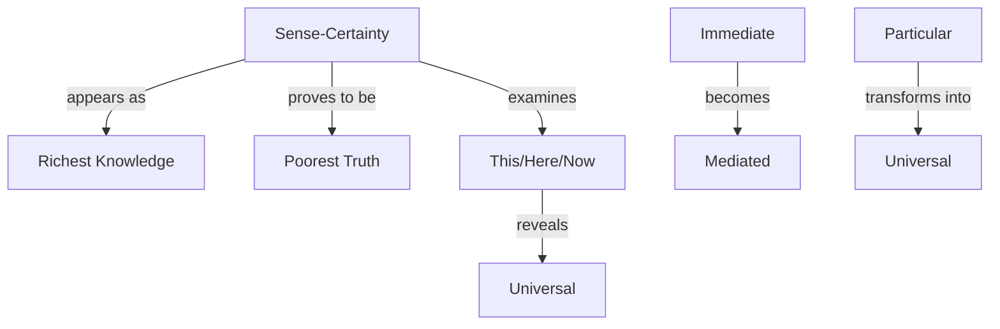

# Temporary Conceptual Map - Sense-Certainty

## Core Structure

## Key Relationships

### Methodological Framework
1. **Consciousness-Object**
   - Initial immediate relation
   - Internal mediation
   - Dialectical development

2. **For Us-For Consciousness**
   - What appears
   - What develops
   - Scientific observation

3. **Truth-Development**
   - Through experience
   - Via negation
   - Toward perception

## Movement Structure

### First Movement: This
1. Initial Stage
   - Immediate certainty
   - Direct relation
   - Pure being

2. Dialectical Process
   - Here/Now analysis
   - Temporal/spatial change
   - Universal emergence

3. Result
   - Mediated knowledge
   - Universal character
   - Negation of immediacy

### Second Movement: I
1. Starting Point
   - Subject certainty
   - Individual knowing
   - Pure immediacy

2. Development
   - Multiple subjects
   - Various perspectives
   - Universal I

3. Outcome
   - Mediated subjectivity
   - Universal knowing
   - New problems

### Third Movement: Unity
1. Initial Unity
   - Whole of sense-certainty
   - Immediate relation
   - Simple truth

2. Process
   - Internal examination
   - Self-undermining
   - Necessary development

3. Resolution
   - Transition to perception
   - New shape emerging
   - Higher unity

## Conceptual Transformations

### Immediacy to Mediation
- Through internal development
- Via necessary moments
- Toward systematic structure

### Particular to Universal
- Through language
- Via negation
- Toward truth

### Simple to Complex
- Through experience
- Via dialectic
- Toward richer knowledge

## Key Points for Lecture

### Methodological
1. Application of Introduction
   - Immanent development
   - Necessary progression
   - Scientific observation

2. Dialectical Movement
   - Internal critique
   - Determinate negation
   - Systematic advance

3. Language Role
   - Universal expression
   - Truth revelation
   - Mediation demonstration

### Conceptual
1. Knowledge Development
   - From immediate to mediate
   - From particular to universal
   - From simple to complex

2. Truth Process
   - Through experience
   - Via negation
   - Toward system

3. Consciousness Structure
   - Subject-object relation
   - Internal development
   - Systematic progression

## Integration Points

### With Previous Work
- Method application
- Systematic development
- Truth emergence

### With Future Development
- Perception preparation
- System building
- Knowledge enrichment