# Hegel Philosophy RooCode Suite - Architecture V11

**Date:** 2025-05-01
**Version:** 11.0
**Based On:**
*   `philosophy_mode_improvement_plan.md` (Phase 1, Step 2 Requirements)
*   `architecture_review_summary_v2.md` (Analysis of V10 and `.clinerules`)
*   Memory Bank Context (Active/Global/Architect-Specific/Feedback as of 2025-05-01 1:41)

**Goal:** Define the enhanced architecture for the Hegel Philosophy RooCode Suite, focusing on improved essay generation, robust reference/citation management, hallucination prevention, optimized memory/knowledge management, and clear orchestration, adhering to RooCode standards.

## 1. Core Principles (Inherited & Reinforced)

*   **Determinacy:** Concepts and arguments must be clearly defined and differentiated.
*   **Evidence Saturation:** Claims must be rigorously linked to source material via extraction markers (`[[EXTRACT:source_file:start_line-end_line]]`).
*   **Chronological Integrity:** Analysis respects the temporal flow of lectures and readings.
*   **Verification Rigor:** Both analysis inputs and generated outputs (essays) undergo verification.
*   **Modularity:** Functionality is encapsulated within specialized modes with clear responsibilities.
*   **Orchestration:** Complex workflows are managed by a dedicated orchestrator mode.

## 2. Mode Structure & Responsibilities

The suite comprises refactored analysis modes, new specialized modes for essay generation and verification, and a central orchestrator.

### 2.1 Knowledge Base Population & Analysis Modes (Refactored)

These modes focus on processing source materials and populating the `knowledge_base`.

*   **`philosophy-text-processing`:**
    *   **Responsibility:** Ingests raw source materials (readings, transcripts, secondary lit PDFs/DOCX), performs initial segmentation, formatting, and adds extraction markers. Prepares text for analysis modes.
    *   **Output:** Processed text files with reliable extraction markers, stored in appropriate workspace directories (e.g., `Readings/`, `Transcripts/`, `SecondaryLit/`). Updates `knowledge_base/references/index.md`.
*   **`philosophy-pre-lecture`:**
    *   **Responsibility:** Analyzes upcoming readings *before* the lecture. Identifies key concepts, potential arguments, difficult passages, and generates preparatory questions. Uses `philosophy-evidence-manager` to store findings.
    *   **Input:** Processed readings from `text-processing`.
    *   **Output:** Structured analysis (concepts, arguments, questions) stored in `knowledge_base/concepts/`, `knowledge_base/arguments/`, `knowledge_base/questions/`. Generates handoff package for `class-analysis`.
*   **`philosophy-class-analysis`:**
    *   **Responsibility:** Analyzes lecture transcripts in conjunction with pre-lecture analysis and readings. Identifies core arguments, concept clarifications, connections, and discrepancies. Uses `philosophy-evidence-manager` to store findings.
    *   **Input:** Processed transcripts, pre-lecture handoff, relevant readings.
    *   **Output:** Structured analysis (arguments, concept updates, connections) stored in `knowledge_base/arguments/`, `knowledge_base/concepts/`. Generates handoff package.
*   **`philosophy-secondary-lit`:**
    *   **Responsibility:** Analyzes secondary literature. Identifies interpretations, critiques, comparisons to primary texts, and scholarly context. Uses `philosophy-evidence-manager` to store findings.
    *   **Input:** Processed secondary literature texts.
    *   **Output:** Structured analysis (interpretations, arguments, concepts) stored in `knowledge_base/arguments/`, `knowledge_base/concepts/`. Updates `knowledge_base/references/index.md`.
*   **`philosophy-dialectical-analysis`:**
    *   **Responsibility:** Performs deeper analysis focusing on dialectical structures, contradictions, and resolutions within specific arguments or across texts, drawing from the `knowledge_base`. Uses `philosophy-evidence-manager` to store findings.
    *   **Input:** Queries to `philosophy-evidence-manager`, specific text segments.
    *   **Output:** Detailed dialectical analyses stored in `knowledge_base/arguments/`.
*   **`philosophy-questioning`:** (Included based on file list)
    *   **Responsibility:** Generates clarifying questions based on analysis outputs or user prompts, interacts with the `knowledge_base` to identify ambiguities or areas needing further investigation.
    *   **Input:** Analysis outputs, user prompts, queries to `philosophy-evidence-manager`.
    *   **Output:** Questions stored in `knowledge_base/questions/`, potentially triggering further analysis tasks via the orchestrator.

### 2.2 Essay Generation & Verification Modes (New & Refactored)

These modes collaborate under the orchestrator to produce verified, well-cited essays.

*   **`philosophy-essay-prep` (Refactored):**
    *   **Responsibility:** Manages the high-level essay writing process. Analyzes the essay prompt, develops a thesis statement, creates a detailed outline, and identifies evidence requirements. Coordinates with `philosophy-evidence-manager` to gather materials and triggers other modes for drafting, citation, and verification. Handles revisions based on verification feedback.
    *   **Input:** Essay prompt, user guidance, feedback from `verification-agent`.
    *   **Output:** Essay outline, evidence package requests, draft requests, revision requests, final approved essay structure. Manages files within `essay_prep/[essay_topic]/`.
*   **`philosophy-evidence-manager` (New):**
    *   **Responsibility:** Acts as the sole interface to the `knowledge_base`. Handles querying, retrieving, and formatting structured data (quotations, arguments, concepts, references) based on requests from other modes (primarily `essay-prep`, `draft-generator`, `verification-agent`). Ensures data consistency.
    *   **Input:** Structured queries (e.g., "Find arguments related to 'Absolute Knowing' in Phenomenology SS 800-808", "Retrieve concept definition for 'Determinate Negation'").
    *   **Output:** Formatted data packages (e.g., Markdown snippets with metadata, JSON objects) containing requested evidence, including source and extraction markers.
*   **`philosophy-draft-generator` (New):**
    *   **Responsibility:** Generates coherent philosophical prose based on an outline and evidence package provided by `essay-prep` (via `evidence-manager`). Focuses on structuring paragraphs, integrating evidence smoothly (using placeholders for citations), and maintaining argumentative flow.
    *   **Input:** Detailed outline, evidence package (containing quotes, argument summaries, concept definitions with source markers).
    *   **Output:** Draft essay text (Markdown) with evidence integrated and citation placeholders (e.g., `[[CITE:ref_key]]`).
*   **`philosophy-citation-manager` (New):**
    *   **Responsibility:** Processes a draft essay containing citation placeholders. Retrieves full reference details from the `knowledge_base` (via `evidence-manager`) using the `ref_key`. Formats and inserts in-text citations according to a specified style (e.g., Chicago). Generates a formatted bibliography.
    *   **Input:** Draft essay with `[[CITE:ref_key]]` placeholders, citation style guide, access to `knowledge_base/references/`.
    *   **Output:** Essay draft with formatted in-text citations, formatted bibliography.
*   **`philosophy-verification-agent` (New):**
    *   **Responsibility:** Verifies claims and citations within a generated essay draft against the `knowledge_base`. Checks for factual accuracy, unsupported claims (hallucinations), correct attribution (using extraction markers), and citation format/accuracy.
    *   **Input:** Essay draft (ideally after citation processing), evidence package used for drafting, access to `knowledge_base`.
    *   **Output:** Verification report detailing any flagged issues (e.g., "Claim on line 45 contradicts source X linked by marker Y", "Citation Z format incorrect", "Statement on line 60 lacks supporting evidence in provided package/knowledge base").

### 2.3 Orchestration Mode (New)

*   **`philosophy-orchestrator`:**
    *   **Responsibility:** Manages complex, multi-step workflows involving multiple modes. Interprets user requests (e.g., "Analyze lecture for Feb 4", "Write essay on Pippin's interpretation of Hegel's Logic"), delegates tasks to appropriate modes, manages handoffs, and sequences operations. Handles error reporting and potential workflow adjustments.
    *   **Key Workflows:**
        *   `analyze_material_cycle`: User Input (Text/Path) -> `text-processing` -> (e.g., `pre-lecture` or `secondary-lit`) -> `evidence-manager` (Store Analysis).
        *   `analyze_lecture_cycle`: User Input (Transcript Path) -> `text-processing` -> `class-analysis` (using pre-lecture handoff) -> `evidence-manager` (Store Analysis).
        *   `write_essay_cycle`: User Prompt -> `essay-prep` (Outline/Thesis) -> `evidence-manager` (Query KB) -> `draft-generator` -> `citation-manager` -> `verification-agent` -> `essay-prep` (Review/Revise based on verification) -> [Loop if needed] -> Final Output.
    *   **Input:** User commands, handoff packages, verification reports.
    *   **Output:** Task delegations, workflow status updates, final results to user.

## 3. Mode Interaction Diagram (Mermaid)

```mermaid
graph TD
    subgraph User Interaction
        User(User)
    end

    subgraph Orchestration
        Orchestrator(philosophy-orchestrator)
    end

    subgraph Knowledge Base Population
        TextProc(philosophy-text-processing)
        PreLec(philosophy-pre-lecture)
        ClassAn(philosophy-class-analysis)
        SecLit(philosophy-secondary-lit)
        DialAn(philosophy-dialectical-analysis)
        Quest(philosophy-questioning)
    end

    subgraph Essay Generation & Verification
        EssayPrep(philosophy-essay-prep)
        DraftGen(philosophy-draft-generator)
        CiteMan(philosophy-citation-manager)
        Verify(philosophy-verification-agent)
    end

    subgraph Data Layer
        EvidMan(philosophy-evidence-manager)
        KB[(knowledge_base)]
        Workspace(analysis_workspace / essay_prep)
    end

    User -- Request --> Orchestrator
    Orchestrator -- Delegate Tasks --> TextProc
    Orchestrator -- Delegate Tasks --> PreLec
    Orchestrator -- Delegate Tasks --> ClassAn
    Orchestrator -- Delegate Tasks --> SecLit
    Orchestrator -- Delegate Tasks --> DialAn
    Orchestrator -- Delegate Tasks --> Quest
    Orchestrator -- Delegate Tasks --> EssayPrep
    Orchestrator -- Results --> User

    TextProc -- Processed Text --> Workspace
    TextProc -- Update Refs --> EvidMan

    PreLec -- Store Analysis --> EvidMan
    ClassAn -- Store Analysis --> EvidMan
    SecLit -- Store Analysis --> EvidMan
    DialAn -- Store Analysis --> EvidMan
    Quest -- Store Questions --> EvidMan

    PreLec -- Query Evidence --> EvidMan
    ClassAn -- Query Evidence --> EvidMan
    SecLit -- Query Evidence --> EvidMan
    DialAn -- Query Evidence --> EvidMan
    Quest -- Query Evidence --> EvidMan

    EssayPrep -- Request Evidence --> EvidMan
    EssayPrep -- Request Draft --> DraftGen
    EssayPrep -- Request Citation --> CiteMan
    EssayPrep -- Request Verification --> Verify
    EssayPrep -- Manage Files --> Workspace

    EvidMan -- Access/Update --> KB
    EvidMan -- Provide Data --> PreLec
    EvidMan -- Provide Data --> ClassAn
    EvidMan -- Provide Data --> SecLit
    EvidMan -- Provide Data --> DialAn
    EvidMan -- Provide Data --> Quest
    EvidMan -- Provide Data --> EssayPrep
    EvidMan -- Provide Data --> DraftGen
    EvidMan -- Provide Data --> CiteMan
    EvidMan -- Provide Data --> Verify

    DraftGen -- Request Evidence --> EvidMan
    DraftGen -- Draft --> EssayPrep

    CiteMan -- Request References --> EvidMan
    CiteMan -- Cited Draft/Biblio --> EssayPrep

    Verify -- Request Evidence/Refs --> EvidMan
    Verify -- Verification Report --> EssayPrep

    %% Styling
    classDef kb fill:#f9f,stroke:#333,stroke-width:2px;
    class KB kb;
    classDef mode fill:#ccf,stroke:#333,stroke-width:1px;
    class Orchestrator,TextProc,PreLec,ClassAn,SecLit,DialAn,Quest,EssayPrep,DraftGen,CiteMan,Verify,EvidMan mode;

```



**Diagram Notes:**
*   Arrows indicate primary data/control flow. Modes interact primarily via the `Orchestrator` for task delegation and the `Evidence Manager` for data access.
*   `knowledge_base` represents the structured data store managed by `Evidence Manager`.
*   `Workspace` represents the file system directories where raw/processed texts and essay drafts are stored.

## 4. Memory Management System: `knowledge_base`

This system replaces less structured approaches and centralizes curated knowledge derived from source materials.

*   **Structure:** A dedicated top-level directory `knowledge_base/` containing subdirectories:
    *   `knowledge_base/concepts/`: Stores definitions, analyses, and relationships of key philosophical concepts. (e.g., `determinate_negation.md`)
    *   `knowledge_base/arguments/`: Stores reconstructed arguments, dialectical analyses, interpretations. (e.g., `phenomenology_ss800_argument.md`)
    *   `knowledge_base/quotations/`: Stores significant quotations extracted from sources, linked via extraction markers. (e.g., `quote_xyz.md`)
    *   `knowledge_base/references/`: Stores bibliographic information for all processed sources, including metadata needed for citation. An `index.md` file tracks all sources. (e.g., `hegel_phenomenology_1977.json`, `index.md`)
    *   `knowledge_base/questions/`: Stores generated questions for clarification or further research. (e.g., `ambiguity_in_ss483.md`)
*   **Entry Format:** Each entry (likely a Markdown or JSON file) should contain:
    *   The core content (definition, argument summary, quote text).
    *   Metadata:
        *   Unique ID.
        *   Source Reference Key (linking to `knowledge_base/references/`).
        *   Extraction Marker(s) (`[[EXTRACT:...]]`) linking back to the precise location(s) in the processed source text.
        *   Timestamp of creation/last update.
        *   Generating Mode.
        *   Tags/Keywords for searchability.
*   **Mode Interactions:**
    *   **Write:** Analysis modes (`PreLec`, `ClassAn`, `SecLit`, `DialAn`, `Quest`) and `TextProc` (for references) write structured data *only* via the `philosophy-evidence-manager`.
    *   **Read/Query:** All modes requiring specific information (esp. `EssayPrep`, `DraftGen`, `CiteMan`, `Verify`) query the `knowledge_base` *only* via the `philosophy-evidence-manager`.
    *   **`philosophy-evidence-manager`:** Provides CRUD (Create, Read, Update, Delete - though updates/deletes should be handled carefully, perhaps versioned) operations and sophisticated querying capabilities (e.g., by keyword, source, concept relationship).
*   **Integration:**
    *   The `knowledge_base` complements the `analysis_workspace/` which holds raw processing outputs and handoffs.
    *   Extraction markers remain the crucial link between `knowledge_base` entries and the source texts stored in the workspace.

## 5. Verification Procedures

Verification occurs at multiple levels, focusing on preventing hallucinations and ensuring reference accuracy in generated essays.

*   **Mechanism 1: Citation Generation & Formatting (`philosophy-citation-manager`)**
    *   Uses `[[CITE:ref_key]]` placeholders inserted by `DraftGen`.
    *   Retrieves full reference data from `knowledge_base/references/` via `Evidence Manager`.
    *   Applies specified citation style rules (e.g., Chicago Manual of Style).
    *   Generates formatted in-text citations and bibliography.
    *   **Accuracy Check:** Ensures the `ref_key` exists and the retrieved data is complete for formatting. Flags missing references.
*   **Mechanism 2: Essay Draft Verification (`philosophy-verification-agent`)**
    *   **Input:** Essay draft (post-citation), evidence package used, access to `knowledge_base`.
    *   **Process:**
        1.  **Claim-Evidence Cross-Reference:** For key claims in the draft, identify associated evidence (via nearby citations or context). Use extraction markers from the evidence (retrieved via `Evidence Manager`) to locate the *original source text*. Compare the draft's claim against the source text snippet. Flag discrepancies, unsupported claims, or potential misinterpretations.
        2.  **Citation Accuracy Check:** Verify that the details in the formatted in-text citation match the corresponding entry in the generated bibliography and the data in `knowledge_base/references/`. Check page numbers against extraction markers where applicable.
        3.  **Quotation Accuracy:** Directly compare quoted text in the draft against the source text identified via extraction markers. Flag any deviations.
    *   **Output:** Detailed verification report for `EssayPrep`.
*   **Workflow for Flagging/Resolving Inaccuracies:**
    1.  `Verification Agent` generates a report with specific, actionable flags (e.g., line number, issue type, evidence link).
    2.  `Orchestrator` passes the report to `Essay Prep`.
    3.  `Essay Prep` analyzes the report.
    4.  `Essay Prep` may:
        *   Attempt to automatically correct minor issues (e.g., citation format).
        *   Request clarification or revised evidence from `Evidence Manager`.
        *   Modify the outline/instructions and request `Draft Generator` to regenerate sections.
        *   Present significant issues to the user for guidance via `Orchestrator`.
    5.  The revised draft is re-submitted to `Verification Agent`.
    6.  Loop continues until verification passes or user accepts remaining issues.

## 6. Configuration Structure

*   **Mode Definition File (`.roo/.roomodes`):**
    *   **Format:** JSON.
    *   **Structure:** A key-value map where the key is the `mode-slug` (e.g., `"philosophy-orchestrator"`) and the value is the relative path to the corresponding `.clinerules` file.
    *   **Example:**
        ```json
        {
          "philosophy-orchestrator": ".roo/rules-philosophy-orchestrator/philosophy-orchestrator.clinerules",
          "philosophy-text-processing": ".roo/rules-philosophy-text-processing/philosophy-text-processing.clinerules",
          "philosophy-pre-lecture": ".roo/rules-philosophy-pre-lecture/philosophy-pre-lecture.clinerules",
          "philosophy-class-analysis": ".roo/rules-philosophy-class-analysis/philosophy-class-analysis.clinerules",
          "philosophy-secondary-lit": ".roo/rules-philosophy-secondary-lit/philosophy-secondary-lit.clinerules",
          "philosophy-dialectical-analysis": ".roo/rules-philosophy-dialectical-analysis/philosophy-dialectical-analysis.clinerules",
          "philosophy-questioning": ".roo/rules-philosophy-questioning/philosophy-questioning.clinerules",
          "philosophy-essay-prep": ".roo/rules-philosophy-essay-prep/philosophy-essay-prep.clinerules",
          "philosophy-evidence-manager": ".roo/rules-philosophy-evidence-manager/philosophy-evidence-manager.clinerules",
          "philosophy-draft-generator": ".roo/rules-philosophy-draft-generator/philosophy-draft-generator.clinerules",
          "philosophy-citation-manager": ".roo/rules-philosophy-citation-manager/philosophy-citation-manager.clinerules",
          "philosophy-verification-agent": ".roo/rules-philosophy-verification-agent/philosophy-verification-agent.clinerules"
        }
        ```
*   **Rules File Directory Structure:**
    *   Each mode's rules file will reside in its own dedicated subdirectory within `.roo/`.
    *   **Path Format:** `.roo/rules-[mode-slug]/[mode-slug].clinerules`
    *   **Example:** The rules for `philosophy-orchestrator` will be located at `.roo/rules-philosophy-orchestrator/philosophy-orchestrator.clinerules`.

This structure ensures clear organization and follows the specified RooCode standards.