### [2025-05-01 17:33:07] Progress Update
- **Status:** Handover Initiated (Critical Context)
- **Details:** Completed Corrective Step 1.4 (Rewrite `.roo/.roomodes`). Context reached 123%. Handing over to new SPARC instance before delegating Corrective Step 2 (`.clinerules` revision planning) to Architect.
- **Link:** [See Active Context 2025-05-01 17:33:07]
# Product Context
### [2025-05-01 19:21:04] - Decision: Pause Implementation & Revise Architecture
- **Decision**: Pause corrective actions on `.clinerules` files. Prioritize documenting new requirements (`philosophy-text-processor`, version control) and revising the system architecture (`architecture_v12.md`) and overall plan (`philosophy_mode_improvement_plan_v2.md`).
- **Rationale**: Address significant user intervention [See Feedback: 2025-05-01 19:21:04] regarding flawed handover, context calculation, and major new functional requirements before proceeding with detailed implementation. Ensures changes are integrated systematically.
- **Outcome**: Plan adjusted. Next step is delegating documentation task to Architect.
## Decision Log
### [2025-05-01 19:30:56] - Decision: Revise Architecture (V12) and Plan (V2)
- **Decision**: Update system architecture to V12 (`architecture_v12.md`) and implementation plan to V2 (`philosophy_mode_improvement_plan_v2.md`).
- **Rationale**: Incorporate new requirements for `philosophy-text-processor` mode (chunking, indexing, citation extraction via scripts) and Git-based version control, as specified in `new_requirements_spec_v1.md` and user feedback [2025-05-01 19:21:04]. Also includes a review step for potentially problematic prior artifacts.
- **Outcome**: `architecture_v12.md` and `philosophy_mode_improvement_plan_v2.md` created.
### [2025-05-01 19:26:26] - Decision: Document New Requirements
- **Decision**: Create `new_requirements_spec_v1.md` to formally document and flesh out user requirements for `philosophy-text-processor` and version control integration.
- **Rationale**: Consolidate requirements from user feedback [2025-05-01 19:21:04] into a structured specification to guide architectural revision (V12) and subsequent implementation planning.
- **Outcome**: Specification document `new_requirements_spec_v1.md` created.

### [2025-05-01 17:41:59] - Decision: Create `.clinerules` Revision Plan
- **Decision**: Create `clinerules_revision_plan_v1.md` to address user feedback [2025-05-01 16:57:41] regarding philosophy mode `.clinerules`.
- **Rationale**: Plan needed to guide systematic revision ensuring consistency, philosophical focus, and orchestrator integration for all 12 modes in `architecture_v11.md`.
- **Outcome**: Plan created, outlining template structure, content requirements, revision process, and next steps. File saved to `clinerules_revision_plan_v1.md`. [See Active Context: 2025-05-01 17:41:59]
### [2025-05-01 19:34:03] - System Architecture V12: Hegel Philosophy Suite
- **Description:** Architecture revised to V12, incorporating `philosophy-text-processor` mode for recursive Markdown source processing and Git-based version control integration. See `architecture_v12.md` for full details, including updated diagrams and interactions.
- **Link:** `architecture_v12.md`
### [2025-05-01 17:41:59] - Progress Update: Corrective Step 2
- **Status**: Corrective Step 2 (Plan `.clinerules` Revision) **Completed**.
- **Details**: Architect mode created `clinerules_revision_plan_v1.md` outlining the revision strategy for all 12 philosophy mode `.clinerules` files, addressing user feedback on structure, focus, and orchestrator integration. [See Active Context: 2025-05-01 17:41:59] [See Decision Log: 2025-05-01 17:41:59]
### [2025-05-01 19:34:03] Progress Update: Architecture V12 & Plan V2 Completed
- **Status:** Architecture Revision Completed. Ready for Phase 0.
- **Details:** Architect mode created `architecture_v12.md` and `philosophy_mode_improvement_plan_v2.md`, integrating the `philosophy-text-processor` mode and version control. [See Active Context: 2025-05-01 19:34:03] [See System Patterns: 2025-05-01 19:34:03]
- **Next Step**: Initiate Phase 0 (Review Intermediate Artifacts) as per `philosophy_mode_improvement_plan_v2.md`.
- **Next Step**: Proceed with Corrective Step 2 implementation (e.g., delegate template creation based on the plan).
<!-- Add new entries below this line -->
[2025-05-01 16:51:30] - SPARC - Decision: Halt Phase 4 (Testing) and initiate corrective actions based on user feedback. Address `.roomodes` file formatting (use root file as example) and location (create separate `.roo/.roomodes` for philosophy modes, update root `./.roomodes`). Delegate planning for `.clinerules` revision to Architect, focusing on consistent structure, philosophical task relevance, and leveraging `philosophy-orchestrator` capabilities (e.g., `new_task`). Resume Phase 4 only after corrections are approved.

### [2025-05-01 19:27:08] Progress Update: New Requirements Documented
- **Status:** Specification for New Requirements Completed.
- **Details:** Architect mode created `new_requirements_spec_v1.md` detailing the `philosophy-text-processor` mode and version control integration. [See Active Context: 2025-05-01 19:27:08]
- **Next Step**: Delegate revision of architecture (`architecture_v12.md`) and plan (`philosophy_mode_improvement_plan_v2.md`) to Architect.
## Progress
<!-- Add new entries below this line -->
[2025-05-01 16:51:30] - SPARC - Status Update: Phase 4 Halted due to user intervention regarding Phase 2/3 outputs. Initiating corrective actions focused on `.roomodes` files (format, location) and planning `.clinerules` revisions. Current step: Read root `./.roomodes` file for format example. [See Intervention 2025-05-01 16:51:30]
<!-- Entries below should be added reverse chronologically (newest first) -->

### [2025-05-01 19:26:26] Progress Update: New Requirements Documented
- **Status:** New Requirements Specification V1 Created.
- **Details:** Architect mode created `new_requirements_spec_v1.md` detailing specifications for `philosophy-text-processor` mode and version control integration, based on user feedback [2025-05-01 19:21:04].
- **Next Step**: Proceed with architectural revision (V12) incorporating these specifications. [See Decision Log: 2025-05-01 19:26:26]

### [2025-05-01 19:21:04] Progress Update: Intervention & Re-Planning
- **Status:** Implementation Paused. Architectural Revision Required.
- **Details:** Received major user intervention regarding context calculation, previous handover issues, and significant new requirements (Text Processor mode, Version Control). Pausing `.clinerules` work. [See Feedback: 2025-05-01 19:21:04] [See Decision Log: 2025-05-01 19:21:04]
- **Next Step**: Delegate documentation of new requirements to Architect.
# System Patterns
### [2025-05-01 19:30:56] - System Architecture V12: Hegel Philosophy Suite
*Maintained primarily by Architect, reflects design in `architecture_v12.md`.*
- **Description:** Architecture V11 enhanced with a detailed `philosophy-text-processor` mode (using external scripts for chunking, indexing, citation extraction) and integrated Git-based version control managed primarily by `philosophy-essay-prep`. Knowledge base updated to store processed chunk indices and detailed citation data.
```mermaid
graph TD
    subgraph User Interaction
        User(User)
    end

    subgraph Orchestration
        Orchestrator(philosophy-orchestrator)
    end

    subgraph Text Processing
        TextProc(philosophy-text-processor) -- Runs --> Scripts((External Scripts))
    end

    subgraph Knowledge Base Population
        PreLec(philosophy-pre-lecture)
        ClassAn(philosophy-class-analysis)
        SecLit(philosophy-secondary-lit)
        DialAn(philosophy-dialectical-analysis)
        Quest(philosophy-questioning)
    end

    subgraph Essay Generation & Verification
        EssayPrep(philosophy-essay-prep) -- Git Ops --> VCS[(Version Control System<br>(Git))]
        DraftGen(philosophy-draft-generator)
        CiteMan(philosophy-citation-manager)
        Verify(philosophy-verification-agent)
    end

    subgraph Data Layer
        EvidMan(philosophy-evidence-manager)
        KB[(knowledge_base<br>+ Processed Indices/Citations)]
        Workspace(analysis_workspace / essay_prep / source_materials/processed)
    end

    User -- Request --> Orchestrator
    Orchestrator -- Delegate Tasks --> TextProc
    Orchestrator -- Delegate Tasks --> PreLec
    Orchestrator -- Delegate Tasks --> ClassAn
    Orchestrator -- Delegate Tasks --> SecLit
    Orchestrator -- Delegate Tasks --> DialAn
    Orchestrator -- Delegate Tasks --> Quest
    Orchestrator -- Delegate Tasks --> EssayPrep
    Orchestrator -- Coordinate Commit? --> EssayPrep
    Orchestrator -- Results --> User

    TextProc -- Processed Chunks/Indices --> Workspace
    TextProc -- Store Index/Chunk Info & Citations --> EvidMan

    PreLec -- Store Analysis --> EvidMan
    ClassAn -- Store Analysis --> EvidMan
    SecLit -- Store Analysis --> EvidMan
    DialAn -- Store Analysis --> EvidMan
    Quest -- Store Questions --> EvidMan

    PreLec -- Query Evidence/Indices --> EvidMan
    ClassAn -- Query Evidence/Indices --> EvidMan
    SecLit -- Query Evidence/Indices --> EvidMan
    DialAn -- Query Evidence/Indices --> EvidMan
    Quest -- Query Evidence/Indices --> EvidMan

    EssayPrep -- Request Evidence/Indices --> EvidMan
    EssayPrep -- Request Draft --> DraftGen
    EssayPrep -- Request Citation --> CiteMan
    EssayPrep -- Request Verification --> Verify
    EssayPrep -- Manage Files --> Workspace

    EvidMan -- Access/Update --> KB
    EvidMan -- Provide Data/Paths --> PreLec
    EvidMan -- Provide Data/Paths --> ClassAn
    EvidMan -- Provide Data/Paths --> SecLit
    EvidMan -- Provide Data/Paths --> DialAn
    EvidMan -- Provide Data/Paths --> Quest
    EvidMan -- Provide Data/Paths --> EssayPrep
    EvidMan -- Provide Data/Paths --> DraftGen
    EvidMan -- Provide Data/Paths --> CiteMan
    EvidMan -- Provide Data/Paths --> Verify

    DraftGen -- Request Evidence --> EvidMan
    DraftGen -- Draft --> EssayPrep
    DraftGen -- Trigger Commit --> Orchestrator

    CiteMan -- Request References/Citation Data --> EvidMan
    CiteMan -- Cited Draft/Biblio --> EssayPrep
    CiteMan -- Trigger Commit --> Orchestrator

    Verify -- Request Evidence/Refs/Chunks --> EvidMan
    Verify -- Verification Report --> EssayPrep

    %% Styling
    classDef kb fill:#f9f,stroke:#333,stroke-width:2px;
    class KB kb;
    classDef mode fill:#ccf,stroke:#333,stroke-width:1px;
    class Orchestrator,TextProc,PreLec,ClassAn,SecLit,DialAn,Quest,EssayPrep,DraftGen,CiteMan,Verify,EvidMan mode;
    classDef script fill:#f0ad4e,stroke:#333,stroke-width:1px;
    class Scripts script;
    classDef vcs fill:#d9edf7,stroke:#31708f,stroke-width:1px;
    class VCS vcs;
```
*(See `architecture_v12.md` for detailed mode descriptions and interactions)*
### [2025-05-01 14:43:50] - System Architecture V11: Hegel Philosophy Suite
*Maintained primarily by Architect, reflects design in `architecture_v11.md`.*
- **Description:** Enhanced architecture featuring a dedicated orchestrator (`philosophy-orchestrator`), a centralized `knowledge_base` accessed via `philosophy-evidence-manager`, and specialized modes for essay drafting (`philosophy-draft-generator`), citation (`philosophy-citation-manager`), and verification (`philosophy-verification-agent`). Refactored analysis modes feed the `knowledge_base`.

```mermaid
graph TD
    subgraph User Interaction
        User(User)
    end

    subgraph Orchestration
        Orchestrator(philosophy-orchestrator)
    end

    subgraph Knowledge Base Population
        TextProc(philosophy-text-processing)
        PreLec(philosophy-pre-lecture)
        ClassAn(philosophy-class-analysis)
        SecLit(philosophy-secondary-lit)
        DialAn(philosophy-dialectical-analysis)
        Quest(philosophy-questioning)
    end

    subgraph Essay Generation & Verification
        EssayPrep(philosophy-essay-prep)
        DraftGen(philosophy-draft-generator)
        CiteMan(philosophy-citation-manager)
        Verify(philosophy-verification-agent)
    end

    subgraph Data Layer
        EvidMan(philosophy-evidence-manager)
        KB[(knowledge_base)]
        Workspace(analysis_workspace / essay_prep)
    end

    User -- Request --> Orchestrator
    Orchestrator -- Delegate Tasks --> TextProc
    Orchestrator -- Delegate Tasks --> PreLec
    Orchestrator -- Delegate Tasks --> ClassAn
    Orchestrator -- Delegate Tasks --> SecLit
    Orchestrator -- Delegate Tasks --> DialAn
    Orchestrator -- Delegate Tasks --> Quest
    Orchestrator -- Delegate Tasks --> EssayPrep
    Orchestrator -- Results --> User

    TextProc -- Processed Text --> Workspace
    TextProc -- Update Refs --> EvidMan

    PreLec -- Store Analysis --> EvidMan
    ClassAn -- Store Analysis --> EvidMan
    SecLit -- Store Analysis --> EvidMan
    DialAn -- Store Analysis --> EvidMan
    Quest -- Store Questions --> EvidMan

    PreLec -- Query Evidence --> EvidMan
    ClassAn -- Query Evidence --> EvidMan
    SecLit -- Query Evidence --> EvidMan
    DialAn -- Query Evidence --> EvidMan
    Quest -- Query Evidence --> EvidMan

    EssayPrep -- Request Evidence --> EvidMan
    EssayPrep -- Request Draft --> DraftGen
    EssayPrep -- Request Citation --> CiteMan
    EssayPrep -- Request Verification --> Verify
    EssayPrep -- Manage Files --> Workspace

    EvidMan -- Access/Update --> KB
    EvidMan -- Provide Data --> PreLec
    EvidMan -- Provide Data --> ClassAn
    EvidMan -- Provide Data --> SecLit
    EvidMan -- Provide Data --> DialAn
    EvidMan -- Provide Data --> Quest
    EvidMan -- Provide Data --> EssayPrep
    EvidMan -- Provide Data --> DraftGen
    EvidMan -- Provide Data --> CiteMan
    EvidMan -- Provide Data --> Verify

    DraftGen -- Request Evidence --> EvidMan
    DraftGen -- Draft --> EssayPrep

    CiteMan -- Request References --> EvidMan
    CiteMan -- Cited Draft/Biblio --> EssayPrep

    Verify -- Request Evidence/Refs --> EvidMan
    Verify -- Verification Report --> EssayPrep

    %% Styling
    classDef kb fill:#f9f,stroke:#333,stroke-width:2px;
    class KB kb;
    classDef mode fill:#ccf,stroke:#333,stroke-width:1px;
    class Orchestrator,TextProc,PreLec,ClassAn,SecLit,DialAn,Quest,EssayPrep,DraftGen,CiteMan,Verify,EvidMan mode;
```

*(See `architecture_v11.md` for detailed mode descriptions and interactions)*
<!-- Entries below should be added reverse chronologically (newest first) -->

# Decision Log
### [2025-05-01 13:26:00] - Decision: Re-delegate Phase 1 Step 1 (Asset Review)
- **Decision**: Re-delegate Phase 1, Step 1 to Architect mode due to user correction regarding the existence and location of `.clinerules` files.
- **Rationale**: Initial delegation was based on incorrect information that `.clinerules` files were missing. Correct information (files exist in root) requires re-analysis by Architect. Previous output (`architecture_review_summary.md`) is invalid.
- **Outcome**: New task created for Architect with corrected instructions and file paths. [See Active Context: 2025-05-01 13:26:00]
### [2025-05-01 13:10:14] - Decision: Plan Hegel Mode Enhancement
- **Decision**: Develop a detailed task prompt and implementation plan for refactoring and enhancing the custom Hegel philosophy RooCode suite.
- **Rationale**: Address user request to improve essay writing capabilities, reference accuracy, hallucination prevention, and memory management within the existing mode structure, following RooCode standards.
- **Outcome**: Created `philosophy_mode_improvement_plan.md` outlining architecture changes, new modes (orchestrator, potential support modes), refactoring steps, memory system design, verification procedures, and configuration structure for handover to SPARC Orchestrator.
<!-- Entries below should be added reverse chronologically (newest first) -->

### [2025-05-01 14:00:00] - Progress Update: Hegel Mode Enhancement
- **Status**: Phase 1, Step 1 (Review Existing Assets - Re-run) **Completed**.
- **Details**: Architect mode successfully re-analyzed existing assets (`architectureV10.md`, `.clinerules-*` files) and produced `architecture_review_summary_v2.md`. [See Active Context: 2025-05-01 13:38:00]
- **Next Step**: Initiating Phase 1, Step 2 (Design New Architecture). [See Active Context: 2025-05-01 14:00:00]
### [2025-05-01 14:46:00] - Progress Update: Hegel Mode Enhancement
### [2025-05-01 17:43:27] Progress Update: Hegel Mode Enhancement
- **Status**: Corrective Step 2 (Plan `.clinerules` revision) **Completed**.
- **Details**: Architect mode created `clinerules_revision_plan_v1.md`.
- **Next Step**: Initiating Corrective Step 3.1 (Delegate `.clinerules` template creation). [See Active Context: 2025-05-01 17:43:27]
- **Status**: Phase 1, Step 2 (Design New Architecture) **Completed**.
### [2025-05-01 17:45:34] Progress Update: Hegel Mode Enhancement
- **Status**: Corrective Step 3.1 (Create `.clinerules` template) **Completed**.
- **Details**: `spec-pseudocode` mode created `clinerules_template_v1.md`.
- **Next Step**: Initiating Corrective Step 3.2 (Delegate revision of `philosophy-orchestrator.clinerules`). [See Active Context: 2025-05-01 17:45:34]
- **Details**: Architect mode successfully designed the V11 architecture and produced `architecture_v11.md`. [See Active Context: 2025-05-01 14:43:50] [See System Patterns: 2025-05-01 14:43:50]
### [2025-05-01 19:30:56] Progress Update: Architecture V12 & Plan V2 Created
- **Status:** Architecture and Plan Revision Completed.
- **Details:** Architect mode created `architecture_v12.md` and `philosophy_mode_improvement_plan_v2.md`, incorporating new requirements for text processing and version control.
- **Next Step**: Proceed with implementation based on `philosophy_mode_improvement_plan_v2.md`, starting with Phase 0 (Pre-Implementation Setup & Review). [See Decision Log: 2025-05-01 19:30:56] [See System Patterns: 2025-05-01 19:30:56]
### [2025-05-01 17:49:06] Progress Update: Hegel Mode Enhancement
- **Status**: Corrective Step 3.2.1 (Revise `philosophy-orchestrator.clinerules`) **Content Generated**.
- **Details**: Architect mode generated the revised content. Context reached 54%. Handing over before writing file.
- **Next Step**: New SPARC instance to write content to `.roo/rules-philosophy-orchestrator/philosophy-orchestrator.clinerules`. [See Active Context: 2025-05-01 17:49:06]
- **Next Step**: Initiating Phase 2, Step 1 (Refactor Existing Modes).
### [2025-05-01 16:40:43] - Progress Update: Hegel Mode Enhancement
- **Status**: Phase 3, Step 2 (Verify Mode Integration) **Completed**.
- **Details**: Architect mode verified `.roomodes` and all 10 philosophy `.clinerules` files against `architecture_v11.md`. No inconsistencies found. Report generated: `integration_verification_report_v11.md`. [See Active Context: 2025-05-01 16:40:43]
- **Next Step**: Proceed with Phase 3, Step 3 (Update SPARC Configuration - if applicable, or conclude Phase 3).
# Progress
### [2025-05-01 17:47:30] - Progress Update: Hegel Mode Enhancement
- **Status**: Corrective Step 3.2.1 (Revise `philosophy-orchestrator.clinerules`) **Completed**.
- **Details**: Architect mode synthesized the content for `philosophy-orchestrator.clinerules` based on template, revision plan, and architecture v11. Content ready for review/implementation.
- **Next Step**: Proceed with next step in Corrective Step 3.2 (e.g., revise next `.clinerules` file). [See Active Context: 2025-05-01 17:47:30]
### [2025-05-01 16:32:23] - Progress Update: Hegel Mode Enhancement
- **Status**: Phase 3, Step 1 (Create `.roomodes` file) **Completed**.
- **Details**: Code mode successfully created the `.roo/.roomodes` file listing all 10 active philosophy modes and their corresponding `.clinerules` paths. [See Active Context: 2025-05-01 16:32:23]
- **Next Step**: Proceed with Phase 3, Step 2 (Update SPARC Configuration).
### [2025-05-01 16:30:22] - Progress Update: Hegel Mode Enhancement
- **Status**: Phase 2, Step 3.4 (Create `philosophy-verification-agent` mode rules) **Completed**.
- **Details**: Code mode successfully created the rules file according to V11 architecture and saved it to `.roo/rules-philosophy-verification-agent/philosophy-verification-agent.clinerules`. [See Active Context: 2025-05-01 16:30:22]
- **Next Step**: Continue Phase 2 (Implement New Modes).
### [2025-05-01 14:27:24] - Progress Update: Hegel Mode Enhancement
- **Status**: Phase 2, Step 3.2 (Create `philosophy-draft-generator` mode rules) **Completed**.
- **Details**: Code mode successfully created the rules file according to V11 architecture and saved it to `.roo/rules-philosophy-draft-generator/philosophy-draft-generator.clinerules`. [See Active Context: 2025-05-01 14:27:24]
- **Next Step**: Continue Phase 2 (Implement New Modes).
### [2025-05-01 14:19:22] - Progress Update: Hegel Mode Enhancement
- **Status**: Phase 2, Step 1.5 (Refactor `philosophy-secondary-lit` rules) **Completed**.
- **Details**: Code mode successfully refactored the rules file according to V11 architecture and saved it to `.roo/rules-philosophy-secondary-lit/philosophy-secondary-lit.clinerules`. [See Active Context: 2025-05-01 14:19:22]
- **Next Step**: Continue Phase 2, Step 1 (Refactor remaining modes).
### [2025-05-01 14:15:09] - Progress Update: Hegel Mode Enhancement
- **Status**: Phase 2, Step 1.4 (Refactor `philosophy-pre-lecture` rules) **Completed**.
- **Details**: Code mode successfully refactored the rules file according to V11 architecture and saved it to `.roo/rules-philosophy-pre-lecture/philosophy-pre-lecture.clinerules`. [See Active Context: 2025-05-01 14:15:09]
- **Next Step**: Continue Phase 2, Step 1 (Refactor remaining modes).
### [2025-05-01 14:08:40] - Progress Update: Hegel Mode Enhancement
- **Status**: Phase 2, Step 1.3 (Refactor `philosophy-essay-prep` rules) **Completed**.
- **Details**: Code mode successfully refactored the rules file according to V11 architecture and saved it to `.roo/rules-philosophy-essay-prep/philosophy-essay-prep.clinerules`. [See Active Context: 2025-05-01 14:08:40]
- **Next Step**: Continue Phase 2, Step 1 (Refactor remaining modes).
### [2025-05-01 14:03:24] - Progress Update: Hegel Mode Enhancement
- **Status**: Phase 2, Step 1.2 (Refactor `philosophy-dialectical-analysis` rules) **Completed**.
- **Details**: Code mode successfully refactored the rules file according to V11 architecture and saved it to `.roo/rules-philosophy-dialectical-analysis/philosophy-dialectical-analysis.clinerules`. [See Active Context: 2025-05-01 14:03:24]
- **Next Step**: Continue Phase 2, Step 1 (Refactor remaining modes).
<!-- Entries below should be added reverse chronologically (newest first) -->