# Product Context
<!-- Entries below should be added reverse chronologically (newest first) -->

# System Patterns
### [2025-05-01 14:43:50] - System Architecture V11: Hegel Philosophy Suite
*Maintained primarily by Architect, reflects design in `architecture_v11.md`.*
- **Description:** Enhanced architecture featuring a dedicated orchestrator (`philosophy-orchestrator`), a centralized `knowledge_base` accessed via `philosophy-evidence-manager`, and specialized modes for essay drafting (`philosophy-draft-generator`), citation (`philosophy-citation-manager`), and verification (`philosophy-verification-agent`). Refactored analysis modes feed the `knowledge_base`.

```mermaid
graph TD
    subgraph User Interaction
        User(User)
    end

    subgraph Orchestration
        Orchestrator(philosophy-orchestrator)
    end

    subgraph Knowledge Base Population
        TextProc(philosophy-text-processing)
        PreLec(philosophy-pre-lecture)
        ClassAn(philosophy-class-analysis)
        SecLit(philosophy-secondary-lit)
        DialAn(philosophy-dialectical-analysis)
        Quest(philosophy-questioning)
    end

    subgraph Essay Generation & Verification
        EssayPrep(philosophy-essay-prep)
        DraftGen(philosophy-draft-generator)
        CiteMan(philosophy-citation-manager)
        Verify(philosophy-verification-agent)
    end

    subgraph Data Layer
        EvidMan(philosophy-evidence-manager)
        KB[(knowledge_base)]
        Workspace(analysis_workspace / essay_prep)
    end

    User -- Request --> Orchestrator
    Orchestrator -- Delegate Tasks --> TextProc
    Orchestrator -- Delegate Tasks --> PreLec
    Orchestrator -- Delegate Tasks --> ClassAn
    Orchestrator -- Delegate Tasks --> SecLit
    Orchestrator -- Delegate Tasks --> DialAn
    Orchestrator -- Delegate Tasks --> Quest
    Orchestrator -- Delegate Tasks --> EssayPrep
    Orchestrator -- Results --> User

    TextProc -- Processed Text --> Workspace
    TextProc -- Update Refs --> EvidMan

    PreLec -- Store Analysis --> EvidMan
    ClassAn -- Store Analysis --> EvidMan
    SecLit -- Store Analysis --> EvidMan
    DialAn -- Store Analysis --> EvidMan
    Quest -- Store Questions --> EvidMan

    PreLec -- Query Evidence --> EvidMan
    ClassAn -- Query Evidence --> EvidMan
    SecLit -- Query Evidence --> EvidMan
    DialAn -- Query Evidence --> EvidMan
    Quest -- Query Evidence --> EvidMan

    EssayPrep -- Request Evidence --> EvidMan
    EssayPrep -- Request Draft --> DraftGen
    EssayPrep -- Request Citation --> CiteMan
    EssayPrep -- Request Verification --> Verify
    EssayPrep -- Manage Files --> Workspace

    EvidMan -- Access/Update --> KB
    EvidMan -- Provide Data --> PreLec
    EvidMan -- Provide Data --> ClassAn
    EvidMan -- Provide Data --> SecLit
    EvidMan -- Provide Data --> DialAn
    EvidMan -- Provide Data --> Quest
    EvidMan -- Provide Data --> EssayPrep
    EvidMan -- Provide Data --> DraftGen
    EvidMan -- Provide Data --> CiteMan
    EvidMan -- Provide Data --> Verify

    DraftGen -- Request Evidence --> EvidMan
    DraftGen -- Draft --> EssayPrep

    CiteMan -- Request References --> EvidMan
    CiteMan -- Cited Draft/Biblio --> EssayPrep

    Verify -- Request Evidence/Refs --> EvidMan
    Verify -- Verification Report --> EssayPrep

    %% Styling
    classDef kb fill:#f9f,stroke:#333,stroke-width:2px;
    class KB kb;
    classDef mode fill:#ccf,stroke:#333,stroke-width:1px;
    class Orchestrator,TextProc,PreLec,ClassAn,SecLit,DialAn,Quest,EssayPrep,DraftGen,CiteMan,Verify,EvidMan mode;
```

*(See `architecture_v11.md` for detailed mode descriptions and interactions)*
<!-- Entries below should be added reverse chronologically (newest first) -->

# Decision Log
### [2025-05-01 13:26:00] - Decision: Re-delegate Phase 1 Step 1 (Asset Review)
- **Decision**: Re-delegate Phase 1, Step 1 to Architect mode due to user correction regarding the existence and location of `.clinerules` files.
- **Rationale**: Initial delegation was based on incorrect information that `.clinerules` files were missing. Correct information (files exist in root) requires re-analysis by Architect. Previous output (`architecture_review_summary.md`) is invalid.
- **Outcome**: New task created for Architect with corrected instructions and file paths. [See Active Context: 2025-05-01 13:26:00]
### [2025-05-01 13:10:14] - Decision: Plan Hegel Mode Enhancement
- **Decision**: Develop a detailed task prompt and implementation plan for refactoring and enhancing the custom Hegel philosophy RooCode suite.
- **Rationale**: Address user request to improve essay writing capabilities, reference accuracy, hallucination prevention, and memory management within the existing mode structure, following RooCode standards.
- **Outcome**: Created `philosophy_mode_improvement_plan.md` outlining architecture changes, new modes (orchestrator, potential support modes), refactoring steps, memory system design, verification procedures, and configuration structure for handover to SPARC Orchestrator.
<!-- Entries below should be added reverse chronologically (newest first) -->

### [2025-05-01 14:00:00] - Progress Update: Hegel Mode Enhancement
- **Status**: Phase 1, Step 1 (Review Existing Assets - Re-run) **Completed**.
- **Details**: Architect mode successfully re-analyzed existing assets (`architectureV10.md`, `.clinerules-*` files) and produced `architecture_review_summary_v2.md`. [See Active Context: 2025-05-01 13:38:00]
- **Next Step**: Initiating Phase 1, Step 2 (Design New Architecture). [See Active Context: 2025-05-01 14:00:00]
### [2025-05-01 14:46:00] - Progress Update: Hegel Mode Enhancement
- **Status**: Phase 1, Step 2 (Design New Architecture) **Completed**.
- **Details**: Architect mode successfully designed the V11 architecture and produced `architecture_v11.md`. [See Active Context: 2025-05-01 14:43:50] [See System Patterns: 2025-05-01 14:43:50]
- **Next Step**: Initiating Phase 2, Step 1 (Refactor Existing Modes).
### [2025-05-01 15:51:00] - Progress Update: Hegel Mode Enhancement - Handover
- **Status**: Phase 2, Step 1.1 (Refactor `philosophy-class-analysis`) **Completed**.
- **Details**: Context size limit (72%) reached. Initiating handover to new SPARC instance as per protocol. [See Active Context: 2025-05-01 15:51:00]
- **Next Step (for new instance)**: Continue Phase 2, Step 1. Refactor `philosophy-dialectical-analysis`.
# Progress
<!-- Entries below should be added reverse chronologically (newest first) -->