# Architect Specific Memory
### Phase 1, Step 2: Design New Architecture - [2025-05-01 14:43:50]
- **Description**: Designed the V11 architecture for the Hegel Philosophy RooCode Suite based on `philosophy_mode_improvement_plan.md` and `architecture_review_summary_v2.md`.
- **Key Decisions**:
    - Introduced `philosophy-orchestrator` for workflow management.
    - Defined `knowledge_base` structure and `philosophy-evidence-manager` for centralized data access.
    - Added specialized modes: `philosophy-draft-generator`, `philosophy-citation-manager`, `philosophy-verification-agent`.
    - Refactored roles of existing analysis modes to populate `knowledge_base`.
    - Defined verification procedures involving `philosophy-verification-agent`.
    - Specified `.roo/.roomodes` and `.roo/rules-[mode-slug]/` structure.
- **Output**: Created `architecture_v11.md` containing the full design.
- **Status**: Architecture design complete. Ready for Phase 1, Step 3 (Implementation Planning).

## System Diagrams
### Diagram: Hegel Philosophy Suite V11 - [2025-05-01 14:43:50]
- **Description:** Overall mode interaction and data flow for the enhanced Hegel suite (V11). Shows orchestration, knowledge base population, essay generation/verification, and the central knowledge base.

```mermaid
graph TD
    subgraph User Interaction
        User(User)
    end

    subgraph Orchestration
        Orchestrator(philosophy-orchestrator)
    end

    subgraph Knowledge Base Population
        TextProc(philosophy-text-processing)
        PreLec(philosophy-pre-lecture)
        ClassAn(philosophy-class-analysis)
        SecLit(philosophy-secondary-lit)
        DialAn(philosophy-dialectical-analysis)
        Quest(philosophy-questioning)
    end

    subgraph Essay Generation & Verification
        EssayPrep(philosophy-essay-prep)
        DraftGen(philosophy-draft-generator)
        CiteMan(philosophy-citation-manager)
        Verify(philosophy-verification-agent)
    end

    subgraph Data Layer
        EvidMan(philosophy-evidence-manager)
        KB[(knowledge_base)]
        Workspace(analysis_workspace / essay_prep)
    end

    User -- Request --> Orchestrator
    Orchestrator -- Delegate Tasks --> TextProc
    Orchestrator -- Delegate Tasks --> PreLec
    Orchestrator -- Delegate Tasks --> ClassAn
    Orchestrator -- Delegate Tasks --> SecLit
    Orchestrator -- Delegate Tasks --> DialAn
    Orchestrator -- Delegate Tasks --> Quest
    Orchestrator -- Delegate Tasks --> EssayPrep
    Orchestrator -- Results --> User

    TextProc -- Processed Text --> Workspace
    TextProc -- Update Refs --> EvidMan

    PreLec -- Store Analysis --> EvidMan
    ClassAn -- Store Analysis --> EvidMan
    SecLit -- Store Analysis --> EvidMan
    DialAn -- Store Analysis --> EvidMan
    Quest -- Store Questions --> EvidMan

    PreLec -- Query Evidence --> EvidMan
    ClassAn -- Query Evidence --> EvidMan
    SecLit -- Query Evidence --> EvidMan
    DialAn -- Query Evidence --> EvidMan
    Quest -- Query Evidence --> EvidMan

    EssayPrep -- Request Evidence --> EvidMan
    EssayPrep -- Request Draft --> DraftGen
    EssayPrep -- Request Citation --> CiteMan
    EssayPrep -- Request Verification --> Verify
    EssayPrep -- Manage Files --> Workspace

    EvidMan -- Access/Update --> KB
    EvidMan -- Provide Data --> PreLec
    EvidMan -- Provide Data --> ClassAn
    EvidMan -- Provide Data --> SecLit
    EvidMan -- Provide Data --> DialAn
    EvidMan -- Provide Data --> Quest
    EvidMan -- Provide Data --> EssayPrep
    EvidMan -- Provide Data --> DraftGen
    EvidMan -- Provide Data --> CiteMan
    EvidMan -- Provide Data --> Verify

    DraftGen -- Request Evidence --> EvidMan
    DraftGen -- Draft --> EssayPrep

    CiteMan -- Request References --> EvidMan
    CiteMan -- Cited Draft/Biblio --> EssayPrep

    Verify -- Request Evidence/Refs --> EvidMan
    Verify -- Verification Report --> EssayPrep

    %% Styling
    classDef kb fill:#f9f,stroke:#333,stroke-width:2px;
    class KB kb;
    classDef mode fill:#ccf,stroke:#333,stroke-width:1px;
    class Orchestrator,TextProc,PreLec,ClassAn,SecLit,DialAn,Quest,EssayPrep,DraftGen,CiteMan,Verify,EvidMan mode;
```

**Notes:** Cross-references `architecture_v11.md` for full details.
### Phase 1, Step 1: Review Existing Assets (Re-run) - [2025-05-01 13:38:00]
- **Description**: Re-ran the review of existing assets (`architectureV10.md`, actual `.clinerules` files in root) as per `philosophy_mode_improvement_plan.md`, based on corrected file information.
- **Findings**: Confirmed strengths (modularity, evidence linking, concept frameworks) and weaknesses (basic essay generation, missing citation generation/verification, lack of essay draft verification, no orchestrator, non-optimal memory for essay research) in V10 architecture and existing rules regarding enhancement goals.
- **Output**: Created `architecture_review_summary_v2.md` detailing the updated findings.
- **Status**: Ready for Phase 1, Step 2: Design New Architecture.
## Architectural Plans
## Task Progress

### Phase 1, Step 1: Review Existing Assets - [2025-05-01 13:21:59]
- **Description**: Completed the review of existing assets (`architectureV10.md`, inferred modes) as per `philosophy_mode_improvement_plan.md`.
- **Findings**: Identified strengths (rigorous principles, modularity, evidence linking) and weaknesses (lack of dynamic evidence retrieval for essays, missing citation generation, insufficient verification in essay context, lack of orchestration, non-optimal memory structure for essays) in V10 architecture regarding essay writing, referencing, and verification.
- **Output**: Created `architecture_review_summary.md` detailing the findings.
- **Status**: Ready for Phase 1, Step 2: Design New Architecture.
<!-- Append new plans using the format below -->

### Plan: Hegel Philosophy Mode Enhancement - [2025-05-01 13:10:42]
- **Description**: Created a detailed task prompt and implementation plan (`philosophy_mode_improvement_plan.md`) for refactoring and enhancing the custom Hegel philosophy RooCode suite.
- **Focus**: Improving essay writing, reference accuracy, hallucination prevention, and memory management.
- **Key Elements**: Defined new architecture (`architecture_v11.md` to be created), new `philosophy-orchestrator` mode, refactoring steps for existing modes, new `.roo` structure for configuration, memory system design, and verification procedures.
- **Status**: Plan ready for handover to SPARC Orchestrator.
<!-- Entries below should be added reverse chronologically (newest first) -->